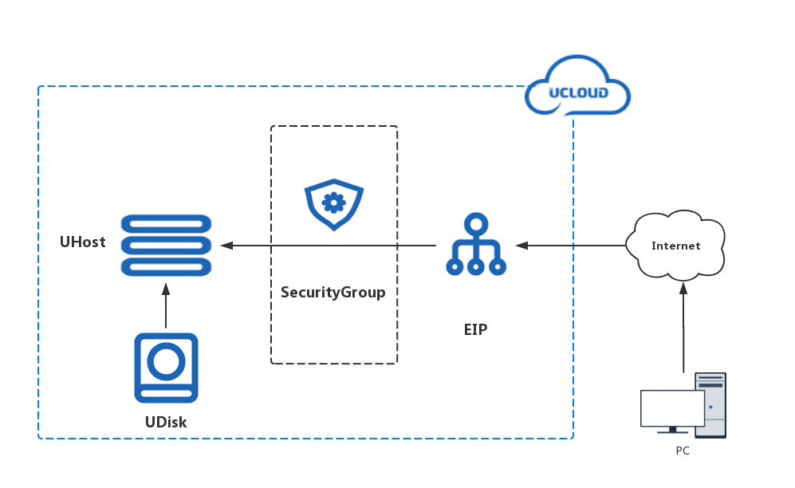

# 搭建一台 web 服务器

**关键词**：*UHost*, *EIP*, *UDisk*

## 摘要

云主机是构建在云环境的弹性计算资源，是 UCloud 最为核心的服务。有些服务，如弹性 IP、镜像、云硬盘等必须与云主机结合后使用，另一些服务，如数据库、缓存、对象存储等可以和云主机结合共同构建 IT 环境。

此案例使用 Terraform 创建一台 web 服务器基础设施，通过创建一台云主机并在云主机上绑定云硬盘和外网弹性IP，同时使用外网防火墙来保护云主机的网络安全性。

使用 Terraform 来创建云主机可以享有由基础设施既代码 (IaC) 带来的便利。通过编写 HCL 文件，可以快速构建包含基础设施定义和它们之间关联的拓扑，并借助于代码版本管理工具，将基础设施的变更纳入版本控制中。

此案例需要一个可用的 UCloud 帐号，以及确保目标可用区有足够的权限和配额可以创建云主机，EIP 和 UDisk。可以在下方 **操作步骤**拷贝使用，或克隆 [官方仓库](https://github.com/ucloud/terraform-provider-ucloud) 以获取完整的 [案例演示代码](https://github.com/ucloud/terraform-provider-ucloud/tree/master/examples/web-server).

## 拓扑图



## 操作步骤

### 定义资源

首先创建基础设施代码文件。

**该样例中包含**:

一个  variables.tf  文件，用于定义输入参数，代码详情如下：
```hcl
variable "region" {
  default = "cn-bj2"
}

variable "zone" {
  default = "cn-bj2-05"
}

variable "instance_password" {
  default = "ucloud_2020"
}
```

一个  main.tf  文件，用于建立一个从云资源到代码的映射，代码详情如下：

```hcl
# 指定 UCloud Provider 和配置信息
provider "ucloud" {
  region = var.region
}

# 查询默认可用区中的主机镜像
data "ucloud_images" "default" {
  availability_zone = var.zone
  name_regex        = "^CentOS 7.[1-2] 64"
  image_type        = "base"
}

# 查询默认推荐 web 外网防火墙
data "ucloud_security_groups" "default" {
    type = "recommend_web"
}

# 创建一台 web 服务器
resource "ucloud_instance" "web" {
    availability_zone = var.zone
    image_id          = data.ucloud_images.default.images[0].id
    instance_type     = "n-basic-2"
    root_password     = var.instance_password
    name              = "tf-example-web-server"
    tag               = "tf-example"
    boot_disk_type    = "cloud_ssd"

    # the default Web Security Group that UCloud recommend to users
    security_group = data.ucloud_security_groups.default.security_groups[0].id

    # create cloud data disk attached to instance
    data_disks {
      size = 20
      type = "cloud_ssd"
    }
    delete_disks_with_instance = true
}

# 创建外网弹性 EIP
resource "ucloud_eip" "default" {
  bandwidth     = 2
  charge_mode   = "bandwidth"
  name          = "tf-example-web-server"
  tag           = "tf-example"
  internet_type = "bgp"
}

# EIP 绑定到主机
resource "ucloud_eip_association" "default" {
  resource_id = ucloud_instance.web.id
  eip_id      = ucloud_eip.default.id
}
```

### 生成执行计划

在当前目录下执行  terraform plan  命令，查看编排计划：

```
Refreshing Terraform state in-memory prior to plan...
The refreshed state will be used to calculate this plan, but will not be
persisted to local or remote state storage.

data.ucloud_images.default: Refreshing state...
data.ucloud_security_groups.default: Refreshing state...

------------------------------------------------------------------------

An execution plan has been generated and is shown below.
Resource actions are indicated with the following symbols:
  + create

Terraform will perform the following actions:

  # ucloud_eip.default will be created
  + resource "ucloud_eip" "default" {
      + bandwidth     = 2
      + charge_mode   = "bandwidth"
      + charge_type   = (known after apply)
      + create_time   = (known after apply)
      + expire_time   = (known after apply)
      + id            = (known after apply)
      + internet_type = "bgp"
      + ip_set        = (known after apply)
      + name          = "tf-example-web-server"
      + public_ip     = (known after apply)
      + remark        = (known after apply)
      + resource      = (known after apply)
      + status        = (known after apply)
      + tag           = "tf-example"
    }

  # ucloud_eip_association.default will be created
  + resource "ucloud_eip_association" "default" {
      + eip_id        = (known after apply)
      + id            = (known after apply)
      + resource_id   = (known after apply)
      + resource_type = (known after apply)
    }

  # ucloud_instance.web will be created
  + resource "ucloud_instance" "web" {
      + auto_renew                 = (known after apply)
      + availability_zone          = "cn-bj2-05"
      + boot_disk_size             = (known after apply)
      + boot_disk_type             = "cloud_ssd"
      + charge_type                = (known after apply)
      + cpu                        = (known after apply)
      + cpu_platform               = (known after apply)
      + create_time                = (known after apply)
      + data_disk_size             = (known after apply)
      + data_disk_type             = (known after apply)
      + delete_disks_with_instance = true
      + disk_set                   = (known after apply)
      + expire_time                = (known after apply)
      + id                         = (known after apply)
      + image_id                   = "uimage-ohveag"
      + instance_type              = "n-basic-2"
      + ip_set                     = (known after apply)
      + isolation_group            = (known after apply)
      + memory                     = (known after apply)
      + name                       = "tf-example-web-server"
      + private_ip                 = (known after apply)
      + remark                     = (known after apply)
      + root_password              = (sensitive value)
      + security_group             = "firewall-h55aem"
      + status                     = (known after apply)
      + subnet_id                  = (known after apply)
      + tag                        = "tf-example"
      + vpc_id                     = (known after apply)

      + data_disks {
          + size = 20
          + type = "cloud_ssd"
        }
    }

Plan: 3 to add, 0 to change, 0 to destroy.

------------------------------------------------------------------------

Note: You didn't specify an "-out" parameter to save this plan, so Terraform
can't guarantee that exactly these actions will be performed if
"terraform apply" is subsequently run.
```

可以看到即将创建一台云主机、一块云硬盘、一个弹性 EIP、一个主机和 EIP 之间的绑定关系，以及一个主机与云硬盘之间的挂载关系。

### 执行编排

执行  terraform apply  命令并确认，执行编排计划：

```
Do you want to perform these actions?
  Terraform will perform the actions described above.
  Only 'yes' will be accepted to approve.

  Enter a value: yes
```

可通过控制台确认资源已创建完成。


## 参考文献

详见 [Instance docs](https://www.terraform.io/docs/providers/ucloud/r/instance.html) 和 [example](https://github.com/ucloud/terraform-provider-ucloud/tree/master/examples/web-server)
