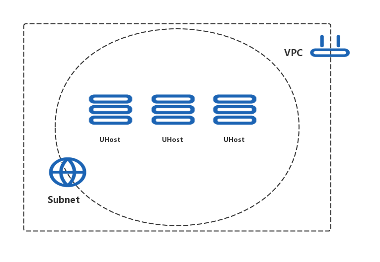

# 私有网络下批量部署多台云主机

**关键词**：*UHost*, *VPC*, *Subnet*

## 摘要

云主机是构建在云环境的弹性计算资源，是 UCloud 最为核心的服务。有些服务，如弹性 IP、镜像、云硬盘等必须与云主机结合后使用，另一些服务，如数据库、缓存、对象存储等可以和云主机结合共同构建 IT 环境。

此案例使用 Terraform 并行批量创建多台云主机，并在每一台云主机上绑定 VPC, Subnet 用于网络隔离。

UCloud 是国内最早采用 SDN 技术的云计算服务商，VPC 基于 SDN 技术构建，是属于用户的、逻辑隔离的网络环境。在私有网络中，可以创建指定网段的 VPC，并在 VPC 中创建子网、自主管理云资源，同时可通过网络 ACL 实现安全防护。

使用 Terraform 来创建云主机除了享有由基础设施既代码 (IaC) 带来的便利外，还可以利用并行资源编排带来的性能提升，当基础设施十分庞大和复杂时，已定义的资源会自动被抽象为有向无环图 (DAG), 寻找尽可能的并行编排路径，以达到较优的编排性能。

此案例需要一个可用的 UCloud 帐号，以及确保目标可用区有足够的权限和配额可以创建云主机，VPC 和防火墙。可以在下方**操作步骤**中拷贝使用，或克隆 [官方仓库](https://github.com/terraform-providers/terraform-provider-ucloud) 以获取完整的 [案例演示代码](https://github.com/terraform-providers/terraform-provider-ucloud/tree/master/examples/intranet-cluster)。

## 拓扑图



## 操作步骤

### 定义资源

首先创建基础设施代码文件，可从 [官方样例](https://github.com/terraform-providers/terraform-provider-ucloud/tree/master/examples/intranet-cluster) 中获取全部源码文件。

一个  variables.tf  文件，用于定义输入参数，代码详情如下：

```tf
variable "region" {
  default = "cn-bj2"
}

variable "instance_password" {
  default = "wA123456"
}

variable "instance_count" {
  default = 3
}

variable "count_format" {
  default = "%02d"
}
```

一个  main.tf  文件，用于建立一个从云资源到代码的映射，代码详情如下：

```hcl
# 指定 UCloud Provider 和配置信息
provider "ucloud" {
  region = "${var.region}"
}

# 查询当前地域下的所有可用区，取第一个可用区作为默认可用区
data "ucloud_zones" "default" {}

# 查询默认可用区中的主机镜像
data "ucloud_images" "default" {
  availability_zone = "${data.ucloud_zones.default.zones.0.id}"
  name_regex        = "^CentOS 7.[1-2] 64"
  image_type        = "base"
}

# 创建 VPC
resource "ucloud_vpc" "default" {
  name = "tf-example-intranet-cluster"
  tag  = "tf-example"

  # vpc network
  cidr_blocks = ["192.168.0.0/16"]
}

# 创建 Subnet 到 VPC 下
resource "ucloud_subnet" "default" {
  name = "tf-example-intranet-cluster"
  tag  = "tf-example"

  # subnet's network must be contained by vpc network
  # and a subnet must have least 8 ip addresses in it (netmask < 30).
  cidr_block = "192.168.1.0/24"

  vpc_id = "${ucloud_vpc.default.id}"
}

# 创建内网集群
resource "ucloud_instance" "intranet" {
  count = "${var.instance_count}"

  availability_zone = "${data.ucloud_zones.default.zones.0.id}"
  image_id          = "${data.ucloud_images.default.images.0.id}"
  instance_type     = "n-basic-2"
  root_password     = "${var.instance_password}"

  # we will put all the instances into same vpc and subnet,
  # so they can communicate with each other.
  vpc_id = "${ucloud_vpc.default.id}"

  subnet_id = "${ucloud_subnet.default.id}"

  name = "tf-example-intranet-cluster-${format(var.count_format, count.index + 1)}"
  tag  = "tf-example"
}
```

### 生成执行计划

在当前目录下执行  terraform plan  命令，查看编排计划：

```
Refreshing Terraform state in-memory prior to plan...
The refreshed state will be used to calculate this plan, but will not be
persisted to local or remote state storage.

data.ucloud_zones.default: Refreshing state...
data.ucloud_images.default: Refreshing state...

------------------------------------------------------------------------

An execution plan has been generated and is shown below.
Resource actions are indicated with the following symbols:
  + create

Terraform will perform the following actions:

  + ucloud_instance.intranet[0]
      id:                     <computed>
      auto_renew:             <computed>
      availability_zone:      "cn-bj2-02"
      boot_disk_size:         <computed>
      boot_disk_type:         <computed>
      charge_type:            "month"
      cpu:                    <computed>
      create_time:            <computed>
      data_disk_size:         <computed>
      data_disk_type:         <computed>
      disk_set.#:             <computed>
      expire_time:            <computed>
      image_id:               "uimage-f1chxn"
      instance_type:          "n-basic-2"
      ip_set.#:               <computed>
      memory:                 <computed>
      name:                   "tf-example-intranet-cluster-01"
      private_ip:             <computed>
      remark:                 <computed>
      root_password:          <sensitive>
      security_group:         <computed>
      status:                 <computed>
      subnet_id:              "${ucloud_subnet.default.id}"
      tag:                    "tf-example"
      vpc_id:                 "${ucloud_vpc.default.id}"

  + ucloud_instance.intranet[1]
      id:                     <computed>
      auto_renew:             <computed>
      availability_zone:      "cn-bj2-02"
      boot_disk_size:         <computed>
      boot_disk_type:         <computed>
      charge_type:            "month"
      cpu:                    <computed>
      create_time:            <computed>
      data_disk_size:         <computed>
      data_disk_type:         <computed>
      disk_set.#:             <computed>
      expire_time:            <computed>
      image_id:               "uimage-f1chxn"
      instance_type:          "n-basic-2"
      ip_set.#:               <computed>
      memory:                 <computed>
      name:                   "tf-example-intranet-cluster-02"
      private_ip:             <computed>
      remark:                 <computed>
      root_password:          <sensitive>
      security_group:         <computed>
      status:                 <computed>
      subnet_id:              "${ucloud_subnet.default.id}"
      tag:                    "tf-example"
      vpc_id:                 "${ucloud_vpc.default.id}"

  + ucloud_instance.intranet[2]
      id:                     <computed>
      auto_renew:             <computed>
      availability_zone:      "cn-bj2-02"
      boot_disk_size:         <computed>
      boot_disk_type:         <computed>
      charge_type:            "month"
      cpu:                    <computed>
      create_time:            <computed>
      data_disk_size:         <computed>
      data_disk_type:         <computed>
      disk_set.#:             <computed>
      expire_time:            <computed>
      image_id:               "uimage-f1chxn"
      instance_type:          "n-basic-2"
      ip_set.#:               <computed>
      memory:                 <computed>
      name:                   "tf-example-intranet-cluster-03"
      private_ip:             <computed>
      remark:                 <computed>
      root_password:          <sensitive>
      security_group:         <computed>
      status:                 <computed>
      subnet_id:              "${ucloud_subnet.default.id}"
      tag:                    "tf-example"
      vpc_id:                 "${ucloud_vpc.default.id}"

  + ucloud_subnet.default
      id:                     <computed>
      cidr_block:             "192.168.1.0/24"
      create_time:            <computed>
      name:                   "tf-example-intranet-cluster"
      remark:                 <computed>
      tag:                    "tf-example"
      vpc_id:                 "${ucloud_vpc.default.id}"

  + ucloud_vpc.default
      id:                     <computed>
      cidr_blocks.#:          "1"
      cidr_blocks.3901788224: "192.168.0.0/16"
      create_time:            <computed>
      name:                   "tf-example-intranet-cluster"
      network_info.#:         <computed>
      remark:                 <computed>
      tag:                    "tf-example"
      update_time:            <computed>


Plan: 5 to add, 0 to change, 0 to destroy.

------------------------------------------------------------------------

Note: You didn't specify an "-out" parameter to save this plan, so Terraform
can't guarantee that exactly these actions will be performed if
"terraform apply" is subsequently run.
```

可以看到即将创建三台云主机、一个 VPC，一个 Subnet。

### 执行编排

执行  terraform apply  命令并确认，执行编排计划：

```
Do you want to perform these actions?
  Terraform will perform the actions described above.
  Only 'yes' will be accepted to approve.

  Enter a value: yes
```

可通过 控制台 确认资源已创建完成。

## 参考文献

详见 [Instance docs](https://www.terraform.io/docs/providers/ucloud/r/instance.html) 和 [example](https://github.com/terraform-providers/terraform-provider-ucloud/tree/master/examples/intranet-cluster)
